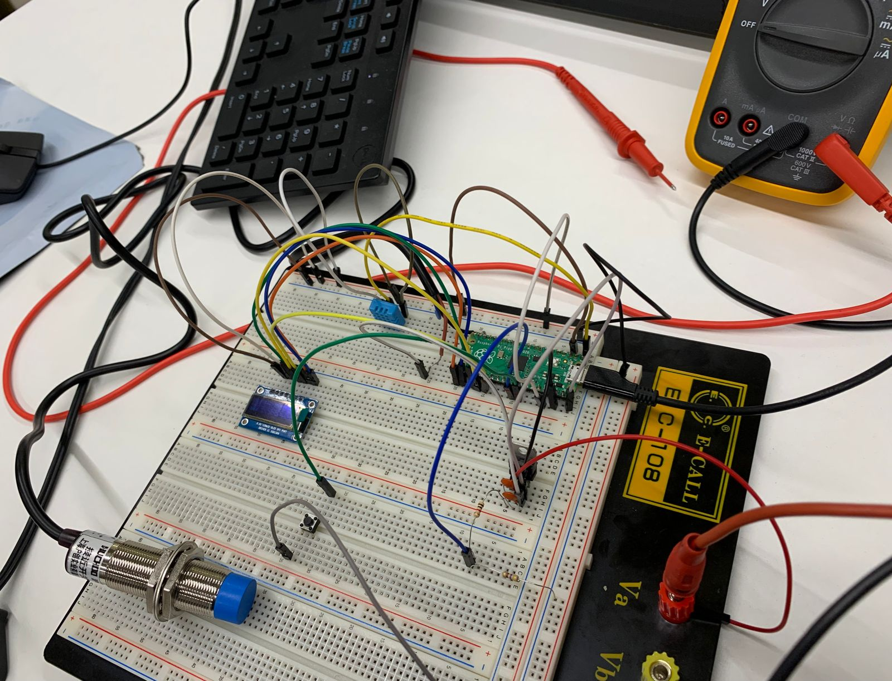
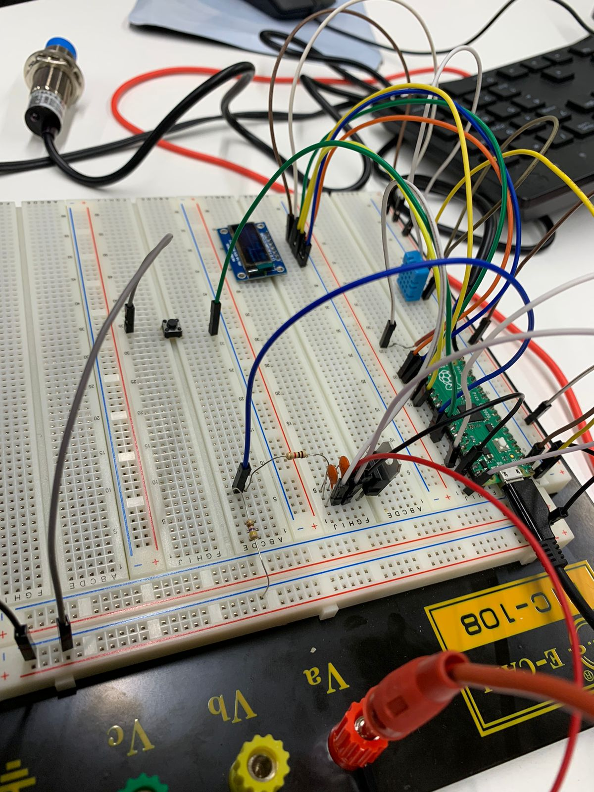
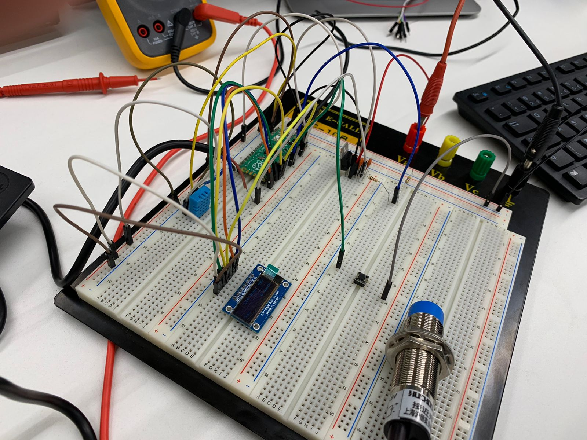

# PC de Bike
Projeto do primeiro semestre da disciplina EEN251-Microcontroladores e Sistemas Embarcados, 4ano Eng. Computação - Instituto Mauá de Tecnologia (IMT), 2022

## Integrantes do grupo:
* Gustavo Lourenço Losada &nbsp; &nbsp; &nbsp; &nbsp; 19.00345-5
* Kaique de Andrade Almeida &nbsp; &nbsp;&hairsp;&nbsp;17.01113-2
* Rodrigo Machado Pedreira &nbsp; &nbsp; &nbsp; 18.01569-7

## Sobre:
O grupo desenvolveu um "computador de bike" que mede a velocidade de deslocamento da bicicleta, a temperatura e umidade do ar e o nível da bateria, estes dados são exibidos um uma tela LCD e um botão permite trocar entre telas.

Para calcular a velocidade fixa-se um pequeno pedaço de alumínio (ou imã) no aro da roda, então um sensor de efeito hall preso em uma das barras que conectam o centro da roda com a bicicleta detecta quando esse pedaço "passa", sinalizando que a roda completou uma revolução. O raio referente a posição do pedaço de alumínio na roda é conhecido, consequentemente é possível calcular a circunferência. Com os dados de deslocamento e tempo tem-se a velocidade de deslocamento da bicicleta.

### Lista de Materiais:
 - Raspberry Pi Pico
 - Display LCD SPI SSD1306
 - Sensor de efeito hall 
 - Sensor de temperatura e umidade DHT11
 - Regulador de tensão linear 5.0V L7805CV
 - Bateria 9V
 - Botão (push button)
 - 2x Resistores (1k e 470 Ohms)
 - 2x Capacitores (100 nF)

### Fotos:
||
|:--:|
|Circuito visto por cima.|

 

||
|:--:|
|Circuito visto pela lateral com destaque para o regulador de tensão.|

 

||
|:--:|
|Circuito visto pela lateral com destaque para o display LCD.|
